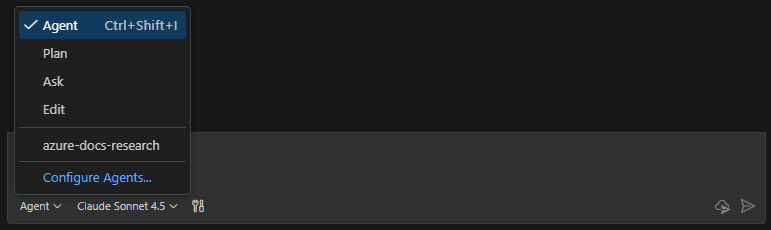
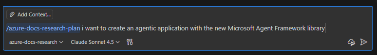
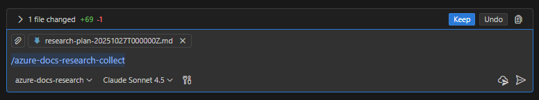
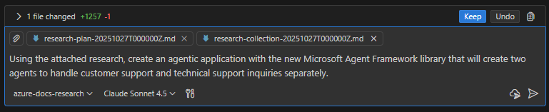

# Spec-Driven Templates for AI Apps Developers

Spec-driven development grounds AI coding agents in living specifications, keeping their output aligned with intent and cutting costly rework.
This repo bundles Spec Kit prompts and templates so GitHub Copilot workflows stay structured from research through implementation.

<video src="https://raw.githubusercontent.com/samelhousseini/sdd-templates/main/images/sddv1.mp4" width="600" controls controlsList="nodownload" allowfullscreen></video>


<iframe width="560" height="315" src="https://www.youtube.com/embed/hG2xrE43HWg" title="YouTube video player" frameborder="0" allow="accelerometer; autoplay; clipboard-write; encrypted-media; gyroscope; picture-in-picture; web-share" referrerpolicy="strict-origin-when-cross-origin" allowfullscreen></iframe>


<br/>

## Usage

### Research Phase
Start with selecting the `azure-docs-research` agent mode.




**Step 1: Generate Research Plan**
```
/azure-docs-research-plan i want to create an agentic application with the new Microsoft Agent Framework library
```




**Step 2: Execute Research Collection**
```
/azure-docs-research-collect
```
**Important:** Attach the filled planning template from Step 1 to your GitHub Copilot chat session before running this command.

**Output:** Research artifacts saved to `.github/scratchpad/`:
- `research-plan-[TIMESTAMP].md`
- `research-collection-[TIMESTAMP].md`



### Implementation Phase
**Step 3: Generate Code with Research Context**

Attach both research files to your GitHub Copilot chat session:
1. `research-plan-[TIMESTAMP].md`
2. `research-collection-[TIMESTAMP].md`

Then restate your original request or modified request to Github Copilot, for example:
```
Using the attached research, create an agentic application with the new Microsoft Agent Framework library that will create two agents to handle customer support and technical support inquiries separately.
```

GitHub Copilot will use the collected documentation, code snippets, and configurations to generate production-ready code.



</br>
</br>

## Examples

**Example 1: Building a RAG application**
```
/azure-docs-research-plan build a RAG application using Azure OpenAI and Azure AI Search with Python
```

**Example 2: Deploying to Azure Container Apps**
```
/azure-docs-research-plan deploy a FastAPI app to Azure Container Apps with managed identity authentication
```

**Example 3: Adding observability**
```
/azure-docs-research-plan add OpenTelemetry tracing to my Azure Functions app and export to Azure Monitor
```
